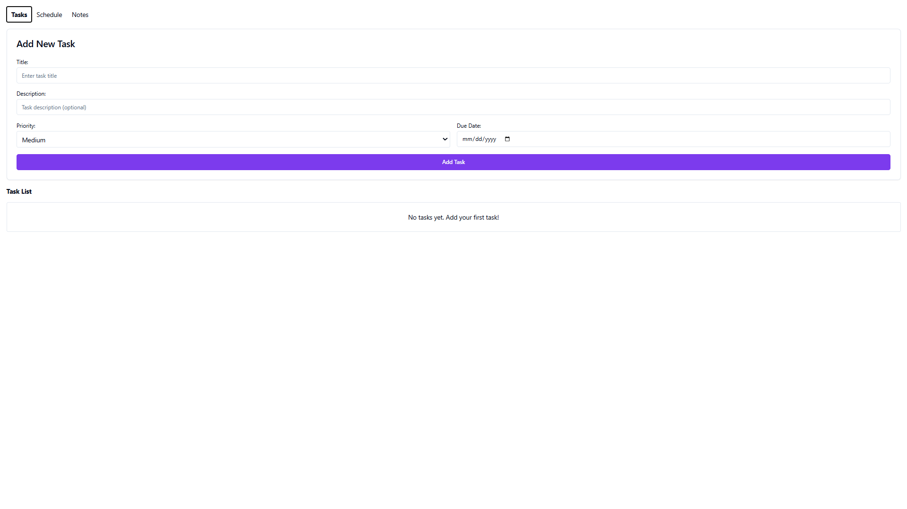
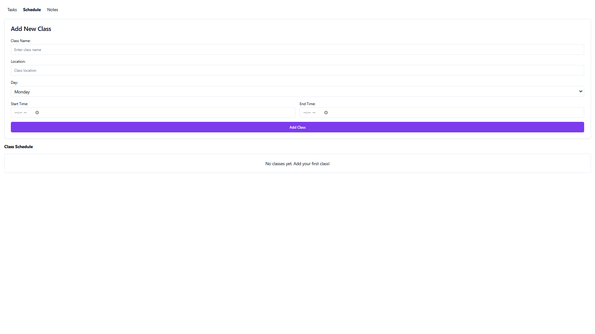
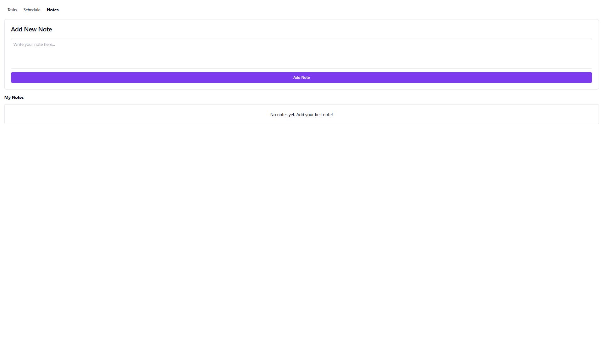

Deskripsi Aplikasi
Personal Dashboard App adalah aplikasi sederhana yang dirancang untuk membantu pengguna mengatur informasi penting sehari-hari, seperti jadwal kuliah, daftar tugas, atau catatan pribadi. Aplikasi ini interaktif, memungkinkan pengguna untuk menambah, mengedit, dan menghapus data, serta menyimpan semua informasi secara lokal menggunakan localStorage.Aplikasi ini dibangun dengan fitur modern JavaScript (ES6+) seperti arrow functions, template literals, async/await, dan Classes untuk memberikan pengalaman pengguna yang lebih baik.

Fitur Utama
Tambah Data : Pengguna dapat menambahkan informasi baru ke dalam dashboard.
Edit Data : Pengguna dapat mengubah informasi yang sudah ada.
Hapus Data : Pengguna dapat menghapus informasi yang tidak diperlukan.
Penyimpanan Lokal : Semua data disimpan di localStorage sehingga tetap tersedia meskipun halaman direfresh.
Desain Responsif : UI sederhana dan mudah digunakan.

Fitur ES6+ yang Diimplementasikan
let dan const : Digunakan untuk deklarasi variabel.
Arrow Functions : Minimal 3 fungsi panah digunakan untuk operasi seperti rendering data, menambahkan data, dan menghapus data.
Template Literals : Digunakan untuk menampilkan data secara dinamis di UI.
Async/Await : Digunakan untuk simulasi operasi asinkron (misalnya, saat menambahkan atau menghapus data).
Classes : Digunakan untuk mengelola data dan logika aplikasi.

Cara Menggunakan Aplikasi
Buka aplikasi di browser.
Tambahkan informasi baru melalui form input.
Edit atau hapus informasi yang sudah ada dengan mengklik tombol yang tersedia.
Data akan otomatis disimpan di localStorage dan tetap tersedia meskipun halaman direfresh.

Screenshot Aplikasi
Berikut adalah tampilan aplikasi yang sudah jadi:

